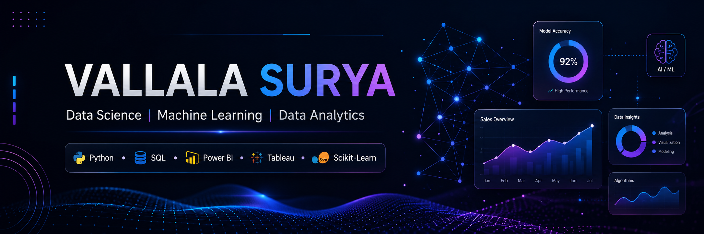

  

<h1 align="center">Hi, I'm Vallala Surya 👋</h1>
<h3 align="center">Aspiring Data Scientist | Machine Learning Enthusiast | Data Analyst</h3>

  

  
  
  

 

## 💫 About Me

- 🎓 B.Tech in Electronics & Communication Engineering
- 📊 Passionate about **Data Science, Machine Learning & Business Intelligence**
- 💡 I enjoy turning raw, messy data into insights that drive decisions
- 🌱 Currently sharpening my skills in **Deep Learning, Model Deployment & Streamlit**
- 🎯 **Goal:** Become a Data Scientist and build impactful, real-world AI solutions
- 📫 Reach me at **vallalasurya4@gmail.com**

 

## 🛠 Tech Stack

  

  
  
  
  
  
  
  
  

 

## 📊 Core Competencies

| Category | Skills |
|---|---|
| **Programming** | Python, SQL |
| **Data Visualization** | Power BI, Tableau, Matplotlib, Seaborn |
| **Machine Learning** | Regression, Classification, Random Forests, Hyperparameter Tuning |
| **Deep Learning** | Neural Networks, TensorFlow, Model Fundamentals |
| **Data Science** | EDA, Data Cleaning, Statistical Analysis, Model Evaluation |
| **Deployment** | Streamlit, Git/GitHub |

 

## 🚀 Featured Projects

<table>
<tr>
<td width="50%" valign="top">

**🏠 [House Price Prediction](https://github.com/vallalasurya/REPO-LINK)**
End-to-end ML pipeline using Random Forest with hyperparameter tuning, deployed as an interactive app via Streamlit.
`Python` `Scikit-learn` `Streamlit`

</td>
<td width="50%" valign="top">

**📊 [SQL Data Analysis](https://github.com/vallalasurya/REPO-LINK)**
Business-focused SQL analysis using joins and window functions to answer real analytical questions.
`SQL` `MySQL`

</td>
</tr>
<tr>
<td width="50%" valign="top">

**📈 [Power BI Sales Dashboard](https://github.com/vallalasurya/REPO-LINK)**
Interactive dashboard tracking sales performance and trends to support business decisions.
`Power BI` `DAX`

</td>
<td width="50%" valign="top">

**📉 [Tableau Dashboard](https://github.com/vallalasurya/REPO-LINK)**
Visual analytics dashboard built to surface key trends and KPIs at a glance.
`Tableau`

</td>
</tr>
<tr>
<td width="50%" valign="top">

**🏏 [IPL Data Analysis](https://github.com/vallalasurya/REPO-LINK)**
Exploratory data analysis on IPL match data using Python to uncover team and player performance trends.
`Python` `Pandas` `EDA`

</td>
<td width="50%" valign="top">

*More projects coming soon — currently building out my Deep Learning & Deployment portfolio.*

</td>
</tr>
</table>

 

## 📈 GitHub Stats

  
  

  

  

  

 

### ⭐ Thanks for visiting my profile!

*"Turning data into meaningful insights."*

